<!-- @format -->

# 4mulaQuery — Intelligent Database Engine

<div align="center">

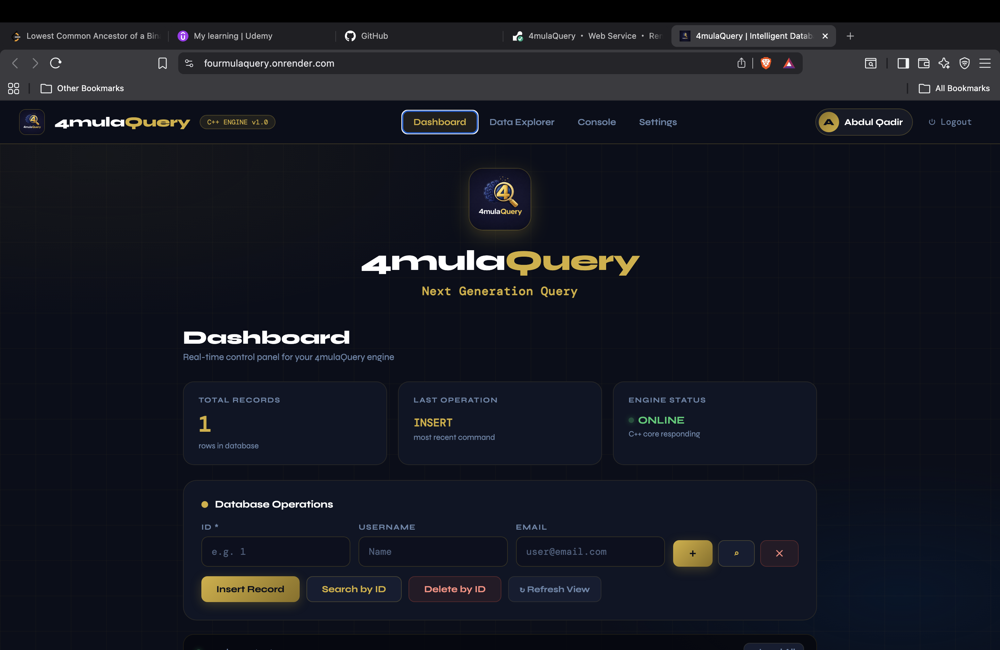

**A high-performance database engine built from scratch**  
_C++ Storage Core • Java Spring Boot API • Docker Deployed_

[](https://fourmulaquery.onrender.com)
[](https://www.java.com)
[](https://isocpp.org)
[](https://docker.com)
[](https://spring.io)

</div>

---

## What is 4mulaQuery?

4mulaQuery is a custom-built relational database engine written from scratch in **C++**, exposed via a **Java Spring Boot REST API**, and deployed using **Docker**. It implements core database concepts including binary file storage, page management, and CRUD operations — without using any existing database library.

> Built to understand how databases actually work under the hood.

---

## Architecture

```
┌─────────────────────────────────────────────────────────┐
│                    Browser / Client                     │
│              fourmulaquery.onrender.com                 │
└──────────────────────┬──────────────────────────────────┘
                       │ HTTP
┌──────────────────────▼──────────────────────────────────┐
│              Java Spring Boot API Layer                 │
│                                                         │
│  ApiController.java   →  REST Endpoints                 │
│  EngineService.java   →  Orchestrator                   │
│  ProcessManager.java  →  C++ Process Lifecycle          │
│  StreamHandler.java   →  stdin / stdout I/O             │
│  QueryLogger.java     →  ML Data Collection             │
│  CommandType.java     →  Command Enum                   │
│  QueryLog.java        →  Query Data Model               │
└──────────────────────┬──────────────────────────────────┘
                       │ subprocess (stdin/stdout)
┌──────────────────────▼──────────────────────────────────┐
│              C++ Database Engine (Core)                 │
│                                                         │
│  main.cpp     →  Command Dispatcher                     │
│  pager.h      →  Binary File I/O (Read/Write)           │
│  common.h     →  Row Schema & Constants                 │
└──────────────────────┬──────────────────────────────────┘
                       │ binary read/write
┌──────────────────────▼──────────────────────────────────┐
│              4mulaQuery.db  (Binary File)               │
└─────────────────────────────────────────────────────────┘
```

---

## Project Structure

```
4mulaQuery/
│
├── app/                          # Java Spring Boot Application
│   ├── src/main/java/com/formulaquery/api/
│   │   ├── ApiApplication.java       # Entry point
│   │   ├── ApiController.java        # REST API endpoints
│   │   ├── WebController.java        # Serves frontend
│   │   ├── EngineService.java        # Main orchestrator
│   │   ├── ProcessManager.java       # C++ process manager
│   │   ├── StreamHandler.java        # I/O stream handler
│   │   ├── QueryLogger.java          # ML data collector
│   │   ├── QueryLog.java             # Query data model
│   │   └── CommandType.java          # Command type enum
│   ├── src/main/resources/static/
│   │   ├── index.html                # Interface of the application
|   |   ├── style.css                 # Layout styles
|   |   ├── app.js                    # Core frontend logic controller
│   │   └── Logo.jpg                  # App logo
│   └── pom.xml
│
├── core/                         # C++ Database Engine
│   ├── main.cpp                      # Engine entry point
│   ├── pager.h                       # Disk I/O handler
│   └── common.h                      # Data structures
│
├── assets/                       # Repository assets
│   └── preview.png                   # Site preview screenshot
│
├── data/                         # Persistent Data (Docker volume)
│   ├── 4mulaQuery.db                 # Binary database file
│   └── query_logs.csv                # ML training data logs
│
├── Dockerfile                    # Multi-stage build
└── docker-compose.yml            # Container orchestration
```

---

## Tech Stack

| Layer            | Technology                                  |           Purpose                          |
| ---------------- | ------------------------------------------- | ------------------------------------------ |
| Storage Engine   | C++ 17                                      | Binary file I/O, CRUD operations           |
| API Layer        | Java 17 + Spring Boot 3.2                   | REST endpoints, process bridge             |
| Build Tool       | Maven                                       | Java dependency management                 |
| Frontend         | HTML + CSS + JavaScript                     | Database UI                                |
| Containerization | Docker + Docker Compose                     | Deployment                                 |
| Hosting          | Render.com                                  | Live cloud deployment                      |
| ML Analytics     | Python + Pandas + Matplotlib + Scikit-learn | Query anomaly detection + pattern analysis |
| ML Model         | Isolation Forest                            | Slow query detection, risk scoring         |
---

## API Endpoints

Base URL: `https://fourmulaquery.onrender.com`

| Method | Endpoint      | Description         | Example                                          |
| ------ | ------------- | ------------------- | ------------------------------------------------ |
| `GET`  | `/api/insert` | Insert a new record | `/api/insert?id=1&name=John&email=john@test.com` |
| `GET`  | `/api/all`    | Fetch all records   | `/api/all`                                       |
| `GET`  | `/api/search` | Search by ID        | `/api/search?id=1`                               |
| `GET`  | `/api/delete` | Delete by ID        | `/api/delete?id=1`                               |

### Example Response

```
1,John,john@test.com
2,Jane,jane@test.com
```

---

## Row Schema

Each record stored in binary format:

```
┌──────────┬──────────────────┬───────────────────────────────────────┐
│  id      │  username        │  email                                │
│  4 bytes │  32 bytes        │  255 bytes                            │
│ uint32_t │  char[32]        │  char[255]                            │
└──────────┴──────────────────┴───────────────────────────────────────┘
Total: 291 bytes per row
```

---

## Setup & Installation

### Prerequisites

- Docker & Docker Compose installed
- Git

### Run Locally

```bash
# 1. Clone the repository
git clone https://github.com/4mulaMind/4mulaQuery.git
cd 4mulaQuery

# 2. Create data directory
mkdir -p data

# 3. Build and run with Docker
docker-compose up --build

# 4. Open in browser
open http://localhost:8080
```

### Build Without Docker

```bash
# C++ Engine
g++ -O3 -std=c++17 core/main.cpp -o core/4mulaQuery

# Java API
cd app
mvn clean package -DskipTests
java -jar target/4mulaQuery-API.jar
```

---

## OOP Design (Java Layer)

The Java layer follows **Single Responsibility Principle** — each class does exactly one thing:

```
EngineService      → Orchestrates all components
ProcessManager     → Spawns and kills C++ process
StreamHandler      → Writes to stdin, reads from stdout
QueryLog           → Data model for one query execution
QueryLogger        → Saves query logs to CSV for ML
CommandType        → Enum: INSERT | SEARCH | DELETE | ALL
```

---

### Login

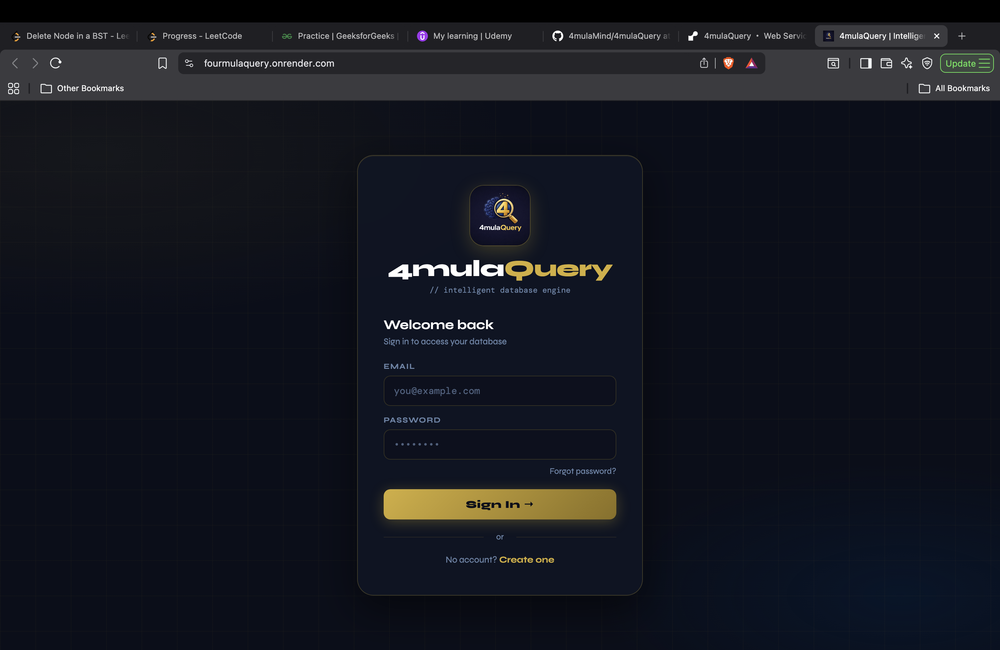

### Dashboard

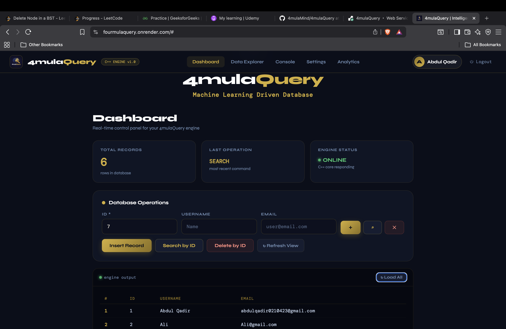

### Analytics

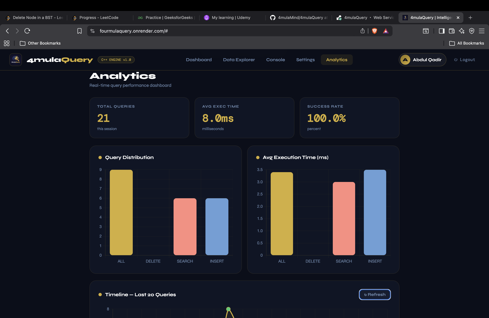

## Analytics Results

| Query Distribution                       | Execution Time                        |
| ---------------------------------------- | ------------------------------------- |
| 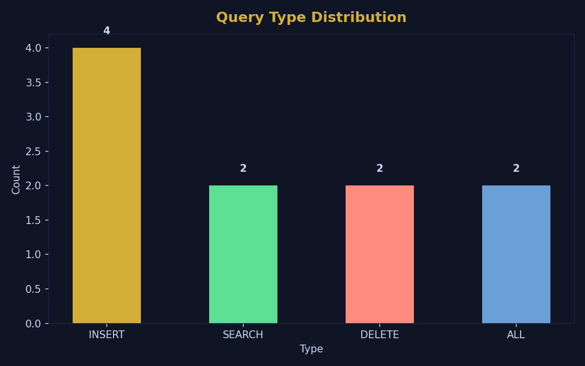 | 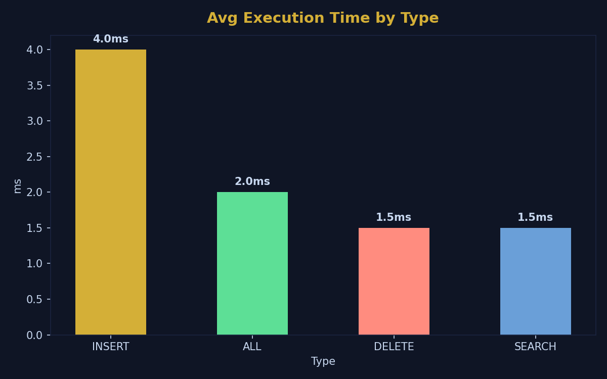 |

| Success Rate                        | Timeline                             |
| ----------------------------------- | ------------------------------------ |
| 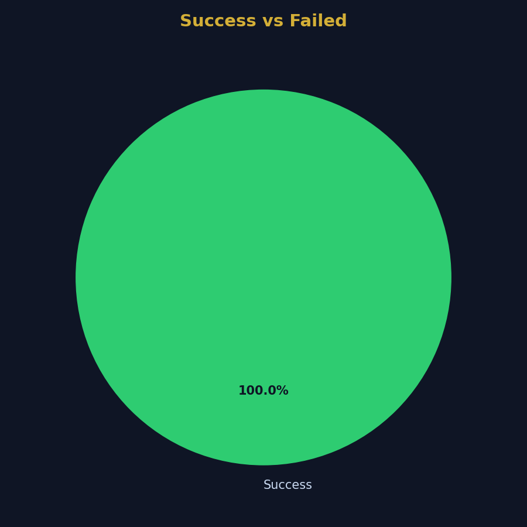 | 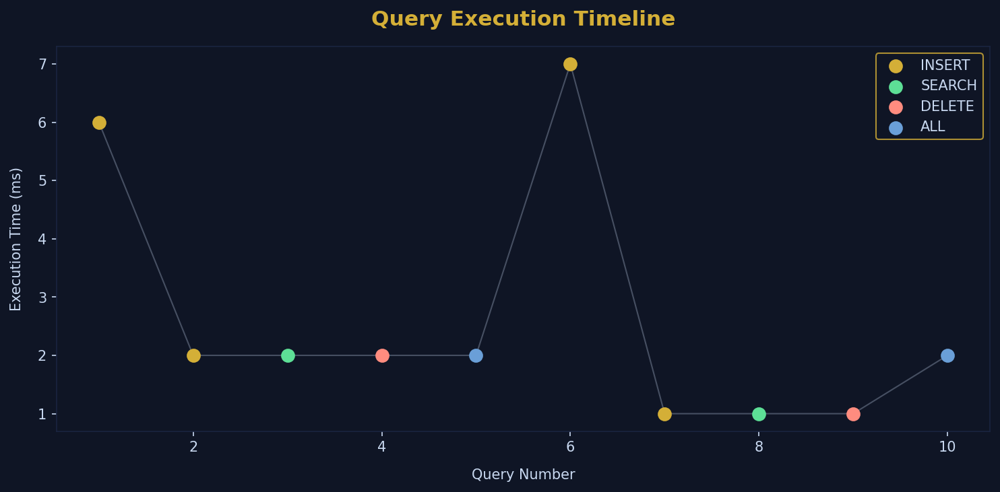 |
| 
## ML Anomaly Detection Results

| Anomaly Timeline | Risk Scores |
|---|---|
| 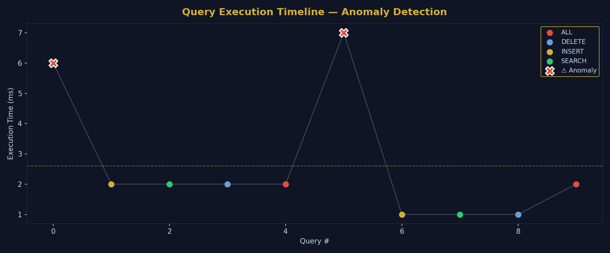 | 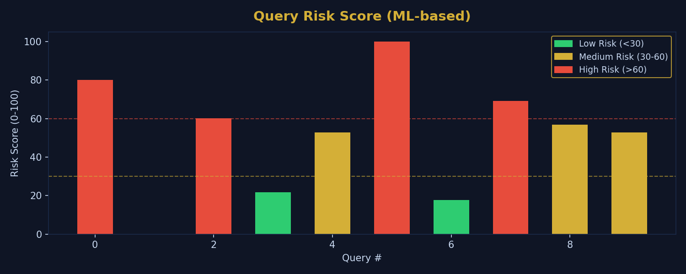 |

| Health Score | Type Performance |
|---|---|
| 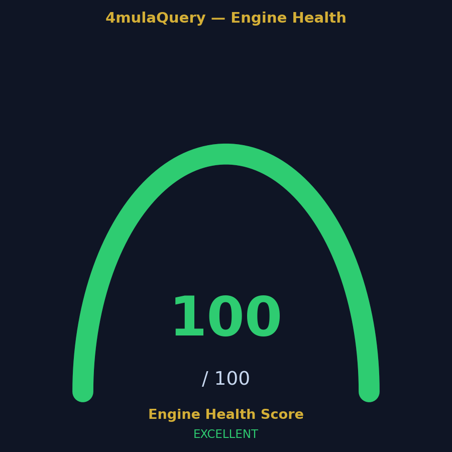 | 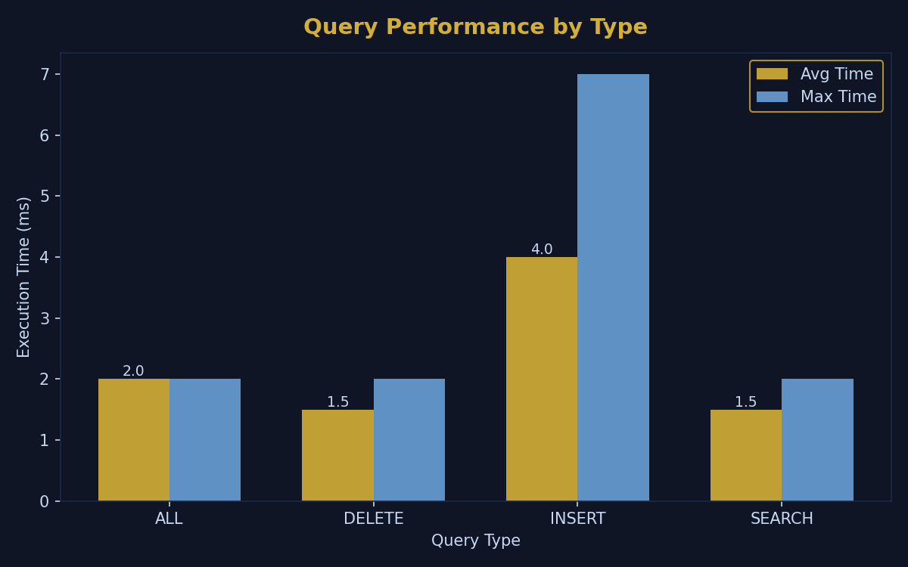 |
---

## ML Query Optimizer (Upcoming)

Every query is automatically logged to `data/query_logs.csv`:

```csv
timestamp,type,execution_ms,success,command
2026-03-29 12:00:01,INSERT,245,true,"insert,1,John,john@test.com"
2026-03-29 12:00:05,SEARCH,183,true,"search,1"
2026-03-29 12:00:09,DELETE,312,true,"delete,1"
```

### Planned ML Pipeline

```
query_logs.csv
      │
      ▼
Python Data Analysis    → EDA, patterns, slow query detection
      │
      ▼
ML Model Training       → Random Forest / Decision Tree
      │
      ▼
Query Optimizer         → Predict best execution strategy
      │
      ▼
REST API Integration    → Java calls Python optimizer
      │
      ▼
Dashboard Analytics     → Real-time performance graphs
```

---

## Roadmap

- [x] C++ binary storage engine
- [x] Java Spring Boot REST API
- [x] Docker deployment
- [x] Web UI with auth system
- [x] Query logging for ML
- [x] OOP refactor (Single Responsibility)
- [x] Python query analytics (analyze.py)
- [x] Analytics Dashboard (Live charts + real-time stats)
- [x] Backend persistent user authentication
- [x] B+ Tree indexing — O(log n) operations
- [x] Python ML Anomaly Detection (Isolation Forest)
- [x] ML Risk Scoring per query
- [x] Engine Health Score
- [ ] SQL Parser (Lexer + AST)
- [ ] ML Query Optimizer (predict slow queries)
- [ ] Distributed version

---

## Key Concepts Implemented

| Concept                         | Where                 |
| ------------------------------- | --------------------- |
| Binary File I/O                 | `pager.h`             |
| Process Spawning (IPC)          | `ProcessManager.java` |
| Stream Redirection              | `StreamHandler.java`  |
| Fixed-width Record Storage      | `common.h`            |
| REST API Design                 | `ApiController.java`  |
| Multi-stage Docker Build        | `Dockerfile`          |
| Single Responsibility Principle | All Java classes      |
| Data Collection for ML          | `QueryLogger.java`    |

---

<div align="center">

**4mulaQuery** — Built from scratch to understand databases from the ground up.

</div>
